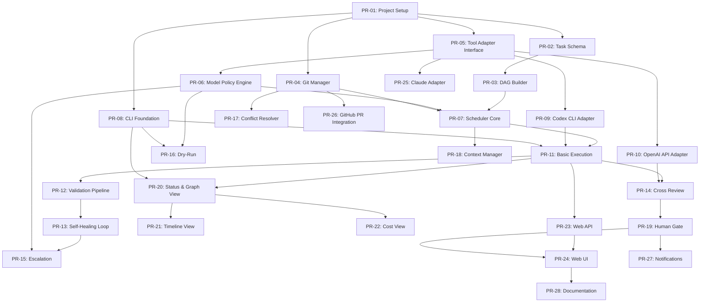

# Implementation Plan: AI Multi-Tool Parallel Dev Orchestrator

> **Version**: 1.0  
> **Last Updated**: 2026-01-02  
> **Based on**: [SPEC.md](./SPEC.md)

---

## 概要

本ドキュメントは、AI Multi-Tool Parallel Dev Orchestratorの実装計画をPR単位でまとめたものです。
各PRは依存関係を考慮して順序付けされており、AIによる実装が可能な粒度で分割されています。

---

## 進捗凡例

| マーク | ステータス |
|--------|----------|
| `[ ]` | 未着手 |
| `[/]` | 進行中 |
| `[x]` | 完了 |
| `[!]` | ブロック中 |

---

## 依存関係グラフ（DAG）



---

## Phase 1: Core（基盤構築）

### PR-01: Project Setup & Configuration
**依存**: なし  
**ステータス**: `[x]`  
**担当**: -  
**見積もり**: 2時間

| サブタスク | 状態 |
|-----------|------|
| `[x]` TypeScript + Node.js プロジェクト初期化 |
| `[x]` package.json 設定（scripts, dependencies） |
| `[x]` tsconfig.json 設定 |
| `[x]` ESLint + Prettier 設定 |
| `[x]` ディレクトリ構造作成 |
| `[x]` 設定ファイルスキーマ定義（config.yaml, credentials.yaml） |
| `[x]` 環境変数ローダー実装 |
| `[x]` 基本的なエラー型定義 |

**成果物**:
```
src/
├── index.ts
├── config/
│   ├── loader.ts
│   ├── schema.ts
│   └── defaults.ts
├── types/
│   └── index.ts
└── errors/
    └── index.ts
```

**完了条件**:
- [ ] `npm run build` が成功する
- [ ] `npm run lint` がエラーなし
- [ ] 設定ファイルの読み込みテストが通る

---

### PR-02: Task Schema & Validation
**依存**: PR-01  
**ステータス**: `[ ]`  
**担当**: -  
**見積もり**: 3時間

| サブタスク | 状態 |
|-----------|------|
| `[ ]` タスク定義の TypeScript 型定義 |
| `[ ]` YAML/JSON パーサー実装 |
| `[ ]` JSON Schema によるバリデーション |
| `[ ]` バリデーションエラーメッセージ |
| `[ ]` タスクIDの一意性チェック |
| `[ ]` デフォルト値の適用ロジック |

**成果物**:
```
src/tasks/
├── types.ts
├── parser.ts
├── validator.ts
└── schema.json
```

**完了条件**:
- [ ] サンプル tasks.yaml が正常にパースできる
- [ ] 不正な YAML に対してわかりやすいエラーが出る
- [ ] ユニットテストカバレッジ 80%以上

---

### PR-03: DAG Builder & Topological Sort
**依存**: PR-02  
**ステータス**: `[ ]`  
**担当**: -  
**見積もり**: 4時間

| サブタスク | 状態 |
|-----------|------|
| `[ ]` DAG データ構造の実装 |
| `[ ]` トポロジカルソートアルゴリズム |
| `[ ]` 循環依存検出（E2001エラー） |
| `[ ]` 依存タスク存在チェック（E1003エラー） |
| `[ ]` in-degree 計算 |
| `[ ]` 並列実行可能タスクの抽出 |
| `[ ]` DAG の可視化用データ出力 |

**成果物**:
```
src/dag/
├── types.ts
├── builder.ts
├── topological-sort.ts
├── cycle-detector.ts
└── visualizer.ts
```

**完了条件**:
- [ ] 循環依存を含むタスクリストでエラーが出る
- [ ] 正しいトポロジカル順序でタスクが返される
- [ ] ユニットテストカバレッジ 90%以上

---

### PR-04: Git Manager
**依存**: PR-01  
**ステータス**: `[ ]`  
**担当**: -  
**見積もり**: 5時間

| サブタスク | 状態 |
|-----------|------|
| `[ ]` Git 操作ラッパー（simple-git使用） |
| `[ ]` ブランチ作成・削除 |
| `[ ]` git worktree 作成・削除 |
| `[ ]` コミット・diff取得 |
| `[ ]` rebase 実行 |
| `[ ]` コンフリクト検出 |
| `[ ]` ブランチ命名規則の適用 |

**成果物**:
```
src/git/
├── types.ts
├── manager.ts
├── worktree.ts
├── branch.ts
└── diff.ts
```

**完了条件**:
- [ ] ブランチ作成・削除が動作する
- [ ] worktree 作成・削除が動作する
- [ ] diff が正しく取得できる
- [ ] 統合テストが通る

---

### PR-05: Tool Adapter Interface
**依存**: PR-01  
**ステータス**: `[ ]`  
**担当**: -  
**見積もり**: 2時間

| サブタスク | 状態 |
|-----------|------|
| `[ ]` ToolAdapter インターフェース定義 |
| `[ ]` ExecutionResult 型定義 |
| `[ ]` ReviewResult 型定義 |
| `[ ]` CostEstimate 型定義 |
| `[ ]` TaskContext 型定義 |
| `[ ]` アダプターレジストリ実装 |

**成果物**:
```
src/adapters/
├── types.ts
├── interface.ts
├── registry.ts
└── base-adapter.ts
```

**完了条件**:
- [ ] インターフェースが定義されている
- [ ] モックアダプターでテストが通る

---

### PR-06: Model & Cost Policy Engine
**依存**: PR-05  
**ステータス**: `[ ]`  
**担当**: -  
**見積もり**: 4時間

| サブタスク | 状態 |
|-----------|------|
| `[ ]` モデルプロファイル型定義 |
| `[ ]` models.yaml パーサー |
| `[ ]` コストポリシー型定義 |
| `[ ]` タスク属性→モデルマッピングロジック |
| `[ ]` tier による順序付け |
| `[ ]` 予算管理（月間/日次） |
| `[ ]` コスト計算ユーティリティ |

**成果物**:
```
src/policy/
├── types.ts
├── model-profile.ts
├── cost-calculator.ts
├── model-selector.ts
└── budget-manager.ts
```

**完了条件**:
- [ ] costTier + complexityHint からモデルが選択できる
- [ ] コスト計算が正しく動作する
- [ ] 予算超過時に警告が出る

---

### PR-07: Scheduler Core
**依存**: PR-03, PR-04, PR-06  
**ステータス**: `[ ]`  
**担当**: -  
**見積もり**: 6時間

| サブタスク | 状態 |
|-----------|------|
| `[ ]` タスク状態管理（Pending, Running, etc.） |
| `[ ]` タスクキュー実装 |
| `[ ]` 並列度制御 |
| `[ ]` 依存解決後のキュー投入 |
| `[ ]` タスク完了時の状態更新 |
| `[ ]` 実行中断・再開機能 |
| `[ ]` 状態永続化（SQLite） |

**成果物**:
```
src/scheduler/
├── types.ts
├── state-manager.ts
├── queue.ts
├── executor.ts
└── persistence.ts
```

**完了条件**:
- [ ] タスクが依存順序で実行される
- [ ] 並列度が制御される
- [ ] 状態がDBに保存される
- [ ] 再起動後に状態が復元される

---

### PR-08: CLI Foundation
**依存**: PR-01  
**ステータス**: `[ ]`  
**担当**: -  
**見積もり**: 3時間

| サブタスク | 状態 |
|-----------|------|
| `[ ]` Commander.js によるCLI構造 |
| `[ ]` `orchestrator --help` |
| `[ ]` `orchestrator --version` |
| `[ ]` `orchestrator validate` コマンド |
| `[ ]` `orchestrator init` コマンド |
| `[ ]` `--verbose`, `--debug` フラグ |
| `[ ]` カラー出力（chalk使用） |

**成果物**:
```
src/cli/
├── index.ts
├── commands/
│   ├── validate.ts
│   └── init.ts
└── utils/
    └── output.ts
```

**完了条件**:
- [ ] `npx orchestrator --help` が動作する
- [ ] validate コマンドがタスクファイルを検証できる
- [ ] init コマンドがテンプレートを生成する

---

## Phase 2: Reliability（信頼性強化）

### PR-09: Codex CLI Adapter
**依存**: PR-05  
**ステータス**: `[ ]`  
**担当**: -  
**見積もり**: 4時間

| サブタスク | 状態 |
|-----------|------|
| `[ ]` Codex CLI プロセス起動 |
| `[ ]` プロンプト構築 |
| `[ ]` 出力パース |
| `[ ]` エラーハンドリング |
| `[ ]` タイムアウト処理 |
| `[ ]` コスト見積もり |

**成果物**:
```
src/adapters/codex/
├── adapter.ts
├── prompt-builder.ts
└── output-parser.ts
```

**完了条件**:
- [ ] Codex CLI でコード生成ができる
- [ ] エラー時に適切なエラーコードが返る

---

### PR-10: OpenAI API Adapter
**依存**: PR-05  
**ステータス**: `[ ]`  
**担当**: -  
**見積もり**: 4時間

| サブタスク | 状態 |
|-----------|------|
| `[ ]` OpenAI SDK 統合 |
| `[ ]` Chat Completion API 呼び出し |
| `[ ]` プロンプトテンプレート |
| `[ ]` レスポンスパース |
| `[ ]` レート制限ハンドリング（E4002） |
| `[ ]` トークン計算 |

**成果物**:
```
src/adapters/openai/
├── adapter.ts
├── client.ts
└── prompts/
    ├── writer.ts
    └── reviewer.ts
```

**完了条件**:
- [ ] OpenAI API でコード生成ができる
- [ ] レビュー機能が動作する
- [ ] レート制限時にリトライする

---

### PR-11: Basic Execution Flow
**依存**: PR-07, PR-08, PR-09  
**ステータス**: `[ ]`  
**担当**: -  
**見積もり**: 5時間

| サブタスク | 状態 |
|-----------|------|
| `[ ]` `orchestrator run` コマンド |
| `[ ]` タスク実行ループ |
| `[ ]` worktree 内でのツール実行 |
| `[ ]` 結果のコミット |
| `[ ]` 基本的なリトライ機能 |
| `[ ]` 実行ログ出力 |

**成果物**:
```
src/cli/commands/
├── run.ts
src/executor/
├── task-runner.ts
└── result-handler.ts
```

**完了条件**:
- [ ] タスクリストを順番に実行できる
- [ ] 各タスクの結果がコミットされる
- [ ] 失敗時にリトライされる

---

### PR-12: Validation Pipeline
**依存**: PR-11  
**ステータス**: `[ ]`  
**担当**: -  
**見積もり**: 4時間

| サブタスク | 状態 |
|-----------|------|
| `[ ]` テストコマンド実行 |
| `[ ]` Lintコマンド実行 |
| `[ ]` 検証結果のパース |
| `[ ]` 検証エラーの構造化（E6001, E6002, E6003） |
| `[ ]` stopOnFailure ロジック |

**成果物**:
```
src/validation/
├── types.ts
├── runner.ts
├── result-parser.ts
└── reporter.ts
```

**完了条件**:
- [ ] テスト/Lint が実行される
- [ ] 失敗ログが構造化される
- [ ] stopOnFailure 設定が動作する

---

### PR-13: Self-Healing Loop
**依存**: PR-12  
**ステータス**: `[ ]`  
**担当**: -  
**見積もり**: 4時間

| サブタスク | 状態 |
|-----------|------|
| `[ ]` 検証失敗時のWriter差し戻しロジック |
| `[ ]` 失敗ログのプロンプト注入 |
| `[ ]` maxValidationRetries カウント |
| `[ ]` 修正ループの実装 |
| `[ ]` ループ履歴の記録 |

**成果物**:
```
src/healing/
├── types.ts
├── loop-controller.ts
└── feedback-builder.ts
```

**完了条件**:
- [ ] 検証失敗時にWriterが再実行される
- [ ] 失敗ログがプロンプトに含まれる
- [ ] 上限回数で停止する

---

### PR-14: Cross Review
**依存**: PR-10, PR-11  
**ステータス**: `[ ]`  
**担当**: -  
**見積もり**: 5時間

| サブタスク | 状態 |
|-----------|------|
| `[ ]` レビュー設定の読み込み |
| `[ ]` diff の取得とフォーマット |
| `[ ]` Reviewer への入力構築 |
| `[ ]` レビュー結果のパース |
| `[ ]` strictness 別の判定ロジック |
| `[ ]` autoFix 機能 |

**成果物**:
```
src/review/
├── types.ts
├── reviewer.ts
├── diff-formatter.ts
├── result-parser.ts
└── auto-fixer.ts
```

**完了条件**:
- [ ] レビュー結果が取得できる
- [ ] 指摘の重要度が判定される
- [ ] autoFix が動作する

---

### PR-15: Dynamic Escalation
**依存**: PR-06, PR-13  
**ステータス**: `[ ]`  
**担当**: -  
**見積もり**: 3時間

| サブタスク | 状態 |
|-----------|------|
| `[ ]` エスカレーショントリガー判定 |
| `[ ]` 上位 tier モデル選択 |
| `[ ]` エスカレーション履歴記録 |
| `[ ]` 最上位失敗時の処理 |
| `[ ]` 差分コスト再計算 |

**成果物**:
```
src/escalation/
├── types.ts
├── controller.ts
└── history.ts
```

**完了条件**:
- [ ] 失敗時に上位モデルに切り替わる
- [ ] 履歴が記録される
- [ ] 最上位でも失敗時にFailed状態になる

---

### PR-16: Dry-Run & Cost Estimation
**依存**: PR-06, PR-08  
**ステータス**: `[ ]`  
**担当**: -  
**見積もり**: 3時間

| サブタスク | 状態 |
|-----------|------|
| `[ ]` `orchestrator plan --dry-run` コマンド |
| `[ ]` 推定トークン数計算 |
| `[ ]` タスク別コスト見積もり |
| `[ ]` 合計コスト計算 |
| `[ ]` 予算残高表示 |
| `[ ]` 確認プロンプト |

**成果物**:
```
src/cli/commands/
├── plan.ts
src/estimation/
├── token-estimator.ts
└── cost-estimator.ts
```

**完了条件**:
- [ ] dry-run で見積もりが表示される
- [ ] 予算超過時に警告が出る

---

### PR-17: Conflict Resolver
**依存**: PR-04  
**ステータス**: `[ ]`  
**担当**: -  
**見積もり**: 4時間

| サブタスク | 状態 |
|-----------|------|
| `[ ]` コンフリクト検出（E3003） |
| `[ ]` 自動 Rebase 試行 |
| `[ ]` Rebase 失敗時の処理（E3004） |
| `[ ]` LLM によるコンフリクト解決（Advanced） |
| `[ ]` 人間への通知 |

**成果物**:
```
src/git/
├── conflict-resolver.ts
└── rebase-handler.ts
```

**完了条件**:
- [ ] コンフリクトが検出される
- [ ] 自動 Rebase が試行される
- [ ] 失敗時にエラーが返る

---

### PR-18: Context Manager
**依存**: PR-07  
**ステータス**: `[ ]`  
**担当**: -  
**見積もり**: 5時間

| サブタスク | 状態 |
|-----------|------|
| `[ ]` ファイルマップ生成（tree相当） |
| `[ ]` 依存タスク成果物の特定 |
| `[ ]` 関連ファイル抽出（import解析） |
| `[ ]` プロンプトへのコンテキスト注入 |
| `[ ]` トークン節約最適化 |

**成果物**:
```
src/context/
├── types.ts
├── file-mapper.ts
├── dependency-collector.ts
├── import-analyzer.ts
└── injector.ts
```

**完了条件**:
- [ ] 依存タスクの変更ファイルが収集される
- [ ] プロンプトに注入される
- [ ] トークン上限を超えない

---

### PR-19: Human Gate
**依存**: PR-14  
**ステータス**: `[ ]`  
**担当**: -  
**見積もり**: 4時間

| サブタスク | 状態 |
|-----------|------|
| `[ ]` WaitingHuman 状態の追加 |
| `[ ]` `orchestrator approve` コマンド |
| `[ ]` `orchestrator reject` コマンド |
| `[ ]` 承認待ちタスク一覧表示 |
| `[ ]` 監査ログ記録 |

**成果物**:
```
src/cli/commands/
├── approve.ts
├── reject.ts
src/human-gate/
├── types.ts
├── controller.ts
└── audit-logger.ts
```

**完了条件**:
- [ ] humanGate: true のタスクが承認待ちになる
- [ ] approve/reject が動作する
- [ ] 監査ログが記録される

---

## Phase 3: Expansion（拡張）

### PR-20: Status & Graph View
**依存**: PR-08, PR-11  
**ステータス**: `[ ]`  
**担当**: -  
**見積もり**: 4時間

| サブタスク | 状態 |
|-----------|------|
| `[ ]` `orchestrator status` コマンド |
| `[ ]` `orchestrator status --graph` |
| `[ ]` ASCII DAG 表示 |
| `[ ]` 状態別の色分け |
| `[ ]` タスク詳細表示 |

**成果物**:
```
src/cli/commands/
├── status.ts
src/visualization/
├── ascii-dag.ts
└── colorizer.ts
```

**完了条件**:
- [ ] DAG が ASCII アートで表示される
- [ ] 状態ごとに色分けされる

---

### PR-21: Timeline View
**依存**: PR-20  
**ステータス**: `[ ]`  
**担当**: -  
**見積もり**: 3時間

| サブタスク | 状態 |
|-----------|------|
| `[ ]` `orchestrator status --timeline` |
| `[ ]` 開始/終了時刻表示 |
| `[ ]` 実行時間計算 |
| `[ ]` 並列度表示 |
| `[ ]` リトライ履歴表示 |

**成果物**:
```
src/visualization/
├── timeline.ts
└── duration-formatter.ts
```

**完了条件**:
- [ ] タイムラインが表示される
- [ ] 並列度がわかる

---

### PR-22: Cost View
**依存**: PR-20  
**ステータス**: `[ ]`  
**担当**: -  
**見積もり**: 3時間

| サブタスク | 状態 |
|-----------|------|
| `[ ]` モデル別消費量表示 |
| `[ ]` タスク別コスト表示 |
| `[ ]` 予算使用率表示 |
| `[ ]` エスカレーションコスト表示 |

**成果物**:
```
src/visualization/
└── cost-view.ts
```

**完了条件**:
- [ ] コスト情報が表示される
- [ ] 予算に対する使用率がわかる

---

### PR-23: Web API
**依存**: PR-11  
**ステータス**: `[ ]`  
**担当**: -  
**見積もり**: 6時間

| サブタスク | 状態 |
|-----------|------|
| `[ ]` Express / Fastify サーバー構築 |
| `[ ]` REST API エンドポイント実装 |
| `[ ]` APIキー認証 |
| `[ ]` レスポンス形式の統一 |
| `[ ]` エラーハンドリング |
| `[ ]` ヘルスチェックエンドポイント |

**成果物**:
```
src/api/
├── server.ts
├── routes/
│   ├── projects.ts
│   ├── runs.ts
│   └── tasks.ts
├── middleware/
│   ├── auth.ts
│   └── error-handler.ts
└── types.ts
```

**完了条件**:
- [ ] API が起動する
- [ ] 全エンドポイントが動作する
- [ ] 認証が機能する

---

### PR-24: Web UI
**依存**: PR-23, PR-19  
**ステータス**: `[ ]`  
**担当**: -  
**見積もり**: 8時間

| サブタスク | 状態 |
|-----------|------|
| `[ ]` React / Vue.js プロジェクト構築 |
| `[ ]` DAG ビュー（D3.js） |
| `[ ]` タイムラインビュー |
| `[ ]` コストビュー |
| `[ ]` ログ表示 |
| `[ ]` Human Gate 承認ボタン |
| `[ ]` リアルタイム更新（WebSocket） |

**成果物**:
```
web/
├── src/
│   ├── components/
│   │   ├── DagView.tsx
│   │   ├── TimelineView.tsx
│   │   ├── CostView.tsx
│   │   └── HumanGate.tsx
│   └── pages/
│       └── Dashboard.tsx
└── package.json
```

**完了条件**:
- [ ] Web UI が表示される
- [ ] DAG がインタラクティブに操作できる
- [ ] Human Gate 承認ができる

---

### PR-25: Claude Code Adapter
**依存**: PR-05  
**ステータス**: `[ ]`  
**担当**: -  
**見積もり**: 4時間

| サブタスク | 状態 |
|-----------|------|
| `[ ]` Claude Code プロセス起動 |
| `[ ]` プロンプト構築 |
| `[ ]` 出力パース |
| `[ ]` Anthropic API 直接呼び出し対応 |

**成果物**:
```
src/adapters/claude/
├── adapter.ts
├── prompt-builder.ts
└── output-parser.ts
```

**完了条件**:
- [ ] Claude Code でコード生成ができる

---

### PR-26: GitHub PR Integration
**依存**: PR-04  
**ステータス**: `[ ]`  
**担当**: -  
**見積もり**: 5時間

| サブタスク | 状態 |
|-----------|------|
| `[ ]` GitHub API クライアント（Octokit） |
| `[ ]` PR 作成 |
| `[ ]` PR マージ |
| `[ ]` ステータスチェック確認 |
| `[ ]` レビューコメント投稿 |

**成果物**:
```
src/git/
├── github/
│   ├── client.ts
│   ├── pr-manager.ts
│   └── status-checker.ts
```

**完了条件**:
- [ ] PR が自動作成される
- [ ] 条件を満たせば自動マージされる

---

### PR-27: Notifications
**依存**: PR-19  
**ステータス**: `[ ]`  
**担当**: -  
**見積もり**: 3時間

| サブタスク | 状態 |
|-----------|------|
| `[ ]` 通知インターフェース定義 |
| `[ ]` Slack Webhook 送信 |
| `[ ]` Discord Webhook 送信 |
| `[ ]` Human Gate 通知 |
| `[ ]` 失敗通知 |

**成果物**:
```
src/notifications/
├── types.ts
├── interface.ts
├── slack.ts
└── discord.ts
```

**完了条件**:
- [ ] Slack/Discord に通知が送れる
- [ ] Human Gate で通知される

---

### PR-28: Documentation
**依存**: PR-24  
**ステータス**: `[ ]`  
**担当**: -  
**見積もり**: 4時間

| サブタスク | 状態 |
|-----------|------|
| `[ ]` README.md |
| `[ ]` Getting Started ガイド |
| `[ ]` CLI リファレンス |
| `[ ]` API リファレンス |
| `[ ]` 設定ファイルリファレンス |
| `[ ]` トラブルシューティング |

**成果物**:
```
docs/
├── getting-started.md
├── cli-reference.md
├── api-reference.md
├── configuration.md
└── troubleshooting.md
```

**完了条件**:
- [ ] ドキュメントが完成している
- [ ] 初めてのユーザーが使い始められる

---

## サマリー

| Phase | PR数 | 見積もり合計 |
|-------|------|-------------|
| Phase 1: Core | 8 | 29時間 |
| Phase 2: Reliability | 11 | 44時間 |
| Phase 3: Expansion | 9 | 40時間 |
| **合計** | **28** | **113時間** |

---

## 次のアクション

1. [ ] PR-01 から順番に実装を開始
2. [ ] 各PRの完了時に本ドキュメントのステータスを更新
3. [ ] ブロッカーがあれば `[!]` マークで記録
